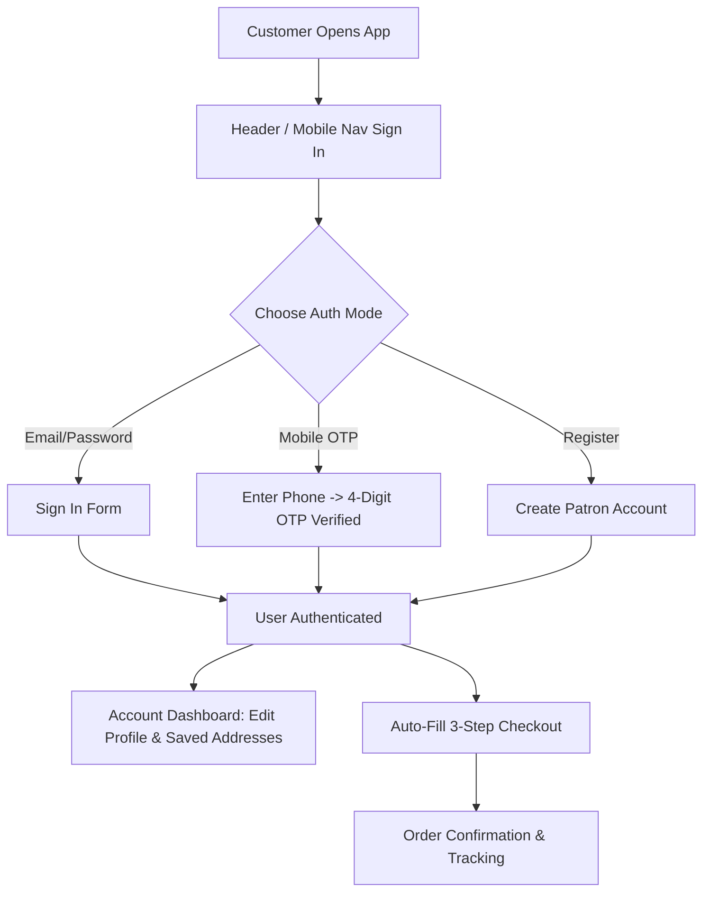

# Product Requirements Document (PRD)
## Project: eclipsera_premium — Luxury Handcrafted Artifacts Platform

**Document Version:** 4.0.0 (Authentication & User Account Management Upgrade)  
**Author:** Senior Product Manager & UX Architect  
**Status:** Approved for Production Execution  
**Target Brand:** eclipsera_premium  

---

## 1. Product Overview

### 1.1 Product Name
`eclipsera_premium`

### 1.2 Brand Identity & Heritage
`eclipsera_premium` is a luxury ecommerce platform dedicated exclusively to **authentic handcrafted non-apparel artifacts**—including Channapatna wooden toys, Kondapalli figurines, solid brass engraved keychains, studio terracotta pottery, hand-painted Madhubani art plaques, and Saharanpur carved teakwood.

**Niche Definition:** Strictly non-clothing handcrafted items. All apparel, garments, and fashion-related listings are excluded to maintain 100% focus on physical craft objects, toys, keychains, and home art.

### 1.3 Authentication & Account Flow Upgrade (v4.0.0)
This version introduces a complete, secure customer and staff authentication architecture:
1.  **Tabbed Auth Center (`/auth`):** Seamless toggle between Sign In and Account Registration.
2.  **Dual Auth Modes:**
    *   **Email & Password Authentication:** Input validation, password visibility toggles, and interactive password reset link generator.
    *   **Instant Mobile OTP Sign-In (Flipkart/Amazon style):** 10-digit mobile number validation with 4-digit OTP code verification (`4821` demo OTP).
3.  **1-Click Social Sign-In Simulators:** Direct Google and Apple ID authentication integration.
4.  **Customer Account Portal (`/account`):** Personal profile manager (Edit Name, Email, Phone), Saved Shipping Address Manager, and quick shortcuts to My Orders and Wishlist.
5.  **Auto-Fill Checkout Integration:** Logged-in customer details automatically populate shipping & billing fields during checkout.

---

## 2. Scope & Feature Matrix

```
+-----------------------------------+-------+---------+---------+---------+
| Feature Capability                | V1    | V2      | V3      | V4 (Now)|
+-----------------------------------+-------+---------+---------+---------+
| Immediate Product Showcase Grid   |  [X]  |   [X]   |   [X]   |   [X]   |
| Live Auto-Suggest Search          |  [ ]  |   [ ]   |   [X]   |   [X]   |
| 2-Column Side-by-Side Mobile Grid |  [ ]  |   [ ]   |   [X]   |   [X]   |
| Customer Email & Password Login   |  [ ]  |   [ ]   |   [ ]   |   [X]   |
| Mobile OTP Verification Login     |  [ ]  |   [ ]   |   [ ]   |   [X]   |
| Customer Account Management View  |  [ ]  |   [ ]   |   [ ]   |   [X]   |
| Auto-Fill Checkout Profile        |  [ ]  |   [ ]   |   [ ]   |   [X]   |
| Admin Panel & Order State Machine |  [X]  |   [X]   |   [X]   |   [X]   |
| Fixed Bottom Mobile Nav (5 Tabs)  |  [ ]  |   [ ]   |   [X]   |   [X]   |
+-----------------------------------+-------+---------+---------+---------+
```

---

## 3. End-to-End E-Commerce & Authentication User Journeys



---

## 4. Technical Architecture & Stack

*   **Frontend Framework:** Next.js App Router / React 18 with TypeScript.
*   **Styling System:** Tailwind CSS + luxury CSS variables (`#FAF7F2`, `#C5A059`, `#0D1117`, `#9E4730`).
*   **Database & State:** Context API with user session persistence simulation.
*   **Authentication Engine:** Email/Password, 4-Digit Mobile OTP, and Social OAuth Simulators.

---
*End of Refined Product Requirements Document v4.0 for eclipsera_premium.*
